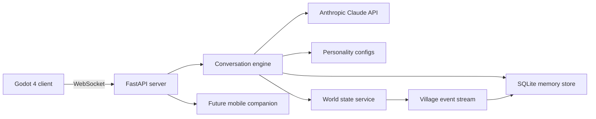

# AI Architecture - Heather's Hollow

> Status: Foundation draft for MVP prototyping.

## Goal

Heather's Hollow needs villagers that feel remembered, situated, and emotionally consistent. The system should make each villager feel like a person who lives in the village, has preferences, knows other villagers, and forms opinions over time. The first architecture target is one villager who can hold a conversation, persist memory locally, and naturally reference shared history.

## System Overview



## Runtime Responsibilities

### Godot Client

- Renders world, villagers, UI, and conversation panel.
- Sends player actions to the server.
- Keeps no authoritative personality or relationship logic.
- May keep short-lived UI state and optimistic inventory state.

### Python Server

- Owns villager personality, memory, relationships, world state, and event history.
- Provides WebSocket conversation endpoints to Godot.
- Later provides REST or WebSocket endpoints to the mobile companion app.
- Can simulate villager-to-villager activity while the client is disconnected.

### Claude API

- Generates in-character dialogue.
- Interprets meaningful gifts or events.
- Produces occasional memory summaries or relationship reflections.
- Should be called through a narrow conversation service, not directly from route handlers.

## Character Personality System

Each villager gets a persistent personality config stored as JSON. This config is the stable root of who they are.

### Personality Config Fields

```json
{
  "id": "margot",
  "display_name": "Margot",
  "species": "rabbit",
  "archetype": "soft-spoken porcelain painter",
  "core_traits": ["gentle", "observant", "slightly shy", "romantic"],
  "values": ["kindness", "handmade things", "quiet mornings"],
  "speaking_style": {
    "sentence_length": "short",
    "tone": "warm and bashful",
    "quirks": ["mentions texture and color", "softly jokes when comfortable"]
  },
  "likes": ["flowers", "tea", "porcelain", "garden vegetables"],
  "dislikes": ["rudeness", "loud surprises", "waste"],
  "relationships": {
    "player": {
      "starting_affection": 5,
      "starting_trust": 10
    }
  },
  "private_goals": [
    "paint a tiny tea set for the village square",
    "become brave enough to host a garden tea party"
  ],
  "system_prompt": "You are Margot, a gentle rabbit villager..."
}
```

### Static vs Dynamic Personality

Static personality:

- Name, species, role, voice.
- Core values.
- Baseline likes and dislikes.
- Backstory anchors.

Dynamic personality:

- Current mood.
- Relationship scores.
- Learned opinions.
- Recent preoccupations.
- Emerging goals.

Dynamic traits should drift slowly. A villager can become warmer or more confident, but should not randomly become a different person.

## Persistent System Prompt

Each villager prompt should be built from:

1. **Global game rules:** tone, safety, game dialogue constraints.
2. **Villager identity:** stable personality config.
3. **Relationship state:** how this villager currently feels about the player and other villagers.
4. **Relevant memories:** retrieved from SQLite.
5. **Current world context:** time, place, weather, recent events.
6. **Player utterance:** latest message.

The static identity block is the best candidate for prompt caching once the Claude integration is optimized.

## Memory Storage

SQLite is the MVP store because it is local, inspectable, low-friction, and enough for early prototyping.

### Tables

#### `villagers`

- `id`
- `display_name`
- `config_path`
- `created_at`

#### `memories`

- `id`
- `villager_id`
- `kind`: `conversation`, `gift`, `event`, `relationship`, `summary`
- `subject_id`: player id, villager id, or world entity id.
- `text`: human-readable memory.
- `salience`: 0-100.
- `emotion`: optional mood tag.
- `created_at`
- `last_accessed_at`
- `access_count`
- `metadata_json`

#### `relationships`

- `villager_id`
- `subject_id`
- `affection`
- `trust`
- `familiarity`
- `tension`
- `updated_at`
- `metadata_json`

#### `conversation_turns`

- `id`
- `conversation_id`
- `villager_id`
- `player_id`
- `speaker`
- `text`
- `created_at`
- `metadata_json`

#### `events`

- `id`
- `kind`
- `actor_id`
- `target_id`
- `location`
- `summary`
- `created_at`
- `metadata_json`

### Memory Kinds

- **Conversation:** What was said and how it felt.
- **Gift:** Item, giver, reaction, relationship effect.
- **Event:** World or villager occurrence.
- **Relationship:** A distilled belief about someone.
- **Summary:** Periodic compressed memory for older conversation clusters.

### Retrieval Strategy

MVP retrieval can use simple SQLite queries:

1. Always include the most recent memories for the villager.
2. Include the highest-salience memories about the player.
3. Include gift memories when the current message or item overlaps.
4. Include recent world events.

Later retrieval can add embeddings. Do not block the first prototype on vector search.

## Conversation Engine

### Request Contract

Godot sends:

```json
{
  "type": "player_message",
  "player_id": "heather",
  "villager_id": "margot",
  "text": "Do you remember what I gave you yesterday?",
  "context": {
    "location": "town_square",
    "client_time": "evening"
  }
}
```

Server returns:

```json
{
  "type": "villager_reply",
  "villager_id": "margot",
  "display_name": "Margot",
  "text": "Of course. That little pumpkin had such a sweet shape...",
  "mood": "warm",
  "relationship": {
    "affection": 8,
    "trust": 12,
    "familiarity": 4
  },
  "memories_used": [12, 18]
}
```

### Prompt Rules

- Keep dialogue in-character and concise.
- Use remembered facts naturally, not as a list.
- Avoid overexplaining memory.
- Let villagers sometimes misremember small subjective details, but do not fabricate major player actions as fact.
- If memory is missing, villagers can say they are unsure.
- Do not mention Claude, APIs, prompts, tokens, or database mechanics.

### LLM Provider Integration

The root server owns provider selection so Godot, browser, and companion clients all hit the same memory and dialogue contract. For no-key local prototyping, use Ollama. For hosted high-quality responses, use Anthropic Claude. For tests and offline demos, keep the deterministic local fallback.

Recommended environment:

- `HOLLOW_LLM_PROVIDER`, one of `fallback`, `ollama`, `anthropic`, or `auto`.
- `ANTHROPIC_API_KEY`
- `ANTHROPIC_MODEL`, defaulting to the current chosen Claude Sonnet model in local config.
- `OLLAMA_BASE_URL`, defaulting to `http://127.0.0.1:11434`.
- `OLLAMA_MODEL`, defaulting to `llama3.2` for the current prototype.
- `OLLAMA_TIMEOUT_SECONDS`, defaulting to `20`.
- `HH_MEMORY_DB`, defaulting to `server/data/heathers_hollow.sqlite3`.

### Error Handling

- If the configured provider fails, times out, or returns invalid output, return an in-character fallback and keep memory writes flowing.
- Never expose raw exceptions to the Godot dialogue UI.
- If WebSocket drops, the client should allow reconnect.
- Memory writes should happen even when fallback dialogue is used.

## Villager-To-Villager Interactions

Villagers should continue to form memories while the player is away. This makes the world feel alive and gives villagers material to discuss.

### Background Simulation

The server can run a periodic tick:

1. Check current world time.
2. Choose plausible villager locations and activities.
3. Generate lightweight events from schedules and relationships.
4. Store those events.
5. Update relationship scores when relevant.
6. Mark high-salience events for later player notification.

### Event Examples

- Margot saw Rowan rearranging shop crates and thought he looked tired.
- Juniper watered the player's garden when it looked dry.
- Two villagers argued gently about where to put flower boxes.
- The shop received a new porcelain cup that Margot likes.

### Generation Cost

Most background events should be procedural templates. Claude should be reserved for:

- High-salience relationship changes.
- Events likely to be surfaced to the player.
- Periodic daily summaries.

## Mood And Emotion State Machine

Mood affects tone, memory interpretation, and willingness to share. It should be legible but not melodramatic.

### Mood States

- `content`: default stable mood.
- `warm`: affectionate, open, likely after good gifts or kind talks.
- `curious`: asks questions, notices changes.
- `shy`: shorter replies, gentle deflection.
- `worried`: references concerns or village tension.
- `annoyed`: polite but clipped, used sparingly.
- `tired`: evening or after effortful events.
- `delighted`: special gift, milestone, surprise.

### State Inputs

- Time of day.
- Recent conversation sentiment.
- Gift preference result.
- Relationship score.
- Recent villager events.
- Repetition or neglect.

### Transition Rules

- Mood shifts should decay back toward `content`.
- Strong memories can pin mood for a few interactions.
- Low relationship trust caps vulnerability.
- High familiarity allows more teasing, specificity, and shared references.

### Data Shape

```json
{
  "current_mood": "warm",
  "mood_intensity": 0.42,
  "expires_at": "2026-05-15T20:00:00Z",
  "causes": ["liked_gift", "recent_kind_conversation"]
}
```

## Mobile Companion Notification System

The mobile app is out of MVP scope, but the server should avoid assumptions that Godot is the only client.

### Notification Candidates

- A villager misses the player.
- A villager references a garden event.
- A relationship milestone happened.
- Shop has an item related to a known preference.
- A villager-to-villager event generated a high-salience story.

### Notification Pipeline

1. Server records a high-salience event.
2. Notification planner checks cooldowns and player preferences.
3. Claude or a template generates a short in-character text.
4. Notification is stored in an outbox.
5. Mobile app polls or subscribes to the outbox.

### Notification Rules

- Never spam.
- Prefer one meaningful message over many low-value pings.
- Villager voice should be recognizable even in one sentence.
- Mobile messages should reference real stored events only.

## Security And Privacy

- Keep `ANTHROPIC_API_KEY` only on the Python server.
- Godot should never contain API keys.
- Local memory DB may include personal-feeling dialogue; treat it as user data.
- Add export/delete memory tooling before wider testing.

## Testing Strategy

### Unit Tests

- Memory insert/retrieve behavior.
- Relationship updates.
- Prompt assembly includes correct context.
- Fallback conversation path works without API key.

### Integration Tests

- WebSocket accepts a message and returns a villager reply.
- Memory persists after server restart.
- Conversation response includes recent memory after a second turn.

### Manual Vertical Slice Test

1. Start the server.
2. Start Godot.
3. Walk to Margot.
4. Talk about a concrete topic.
5. Restart the server.
6. Talk again and check that Margot can reference the prior topic.

## Mood And Relationship Tuning Rules

> Status: HH-006 tuning notes, drafted 2026-05-15 against the shipped code in `server/ai/conversation.py` and `server/ai/mood.py`. The gift-path softening (disliked → melancholy at -1 affection, loved-gift mood-tracker nudge weight 2.5) shipped in the second Cowork overnight heartbeat. The talk-path daily caps, the personal-disclosure mood-nudge bump (0.45 → 0.6 when the player text uses `i`/`my`/`remember`/`feel`/`love`/`miss`), the disliked-gift mood-tracker nudge drop (0.55 → 0.35), and the cozy negative-mood intensity cap (`irritated`/`anxious` ≤ 0.7 with the excess redirected to adjacent moods) shipped in the seventh Cowork overnight heartbeat with coverage in `server/tests/test_talk_caps.py` and the extended `server/tests/test_mood.py`. **HH-062 per-villager loved-gift rubric** shipped in the eighth Cowork overnight heartbeat: each villager's personality JSON now carries an optional `loved_tags` list, the gift engine scores "loved" against that per-villager set (with a `DEFAULT_LOVED_TAGS` fallback for older configs), and the starter inventory grew four cast-specific items (lavender sachet → Fern, honey oat crust → Hugo, marigold sprig → Clover/Margot, sea glass shard → Clover) so the demo can show four distinct delighted reactions instead of every villager loving the same Dusty Rose. Coverage lives in the extended `server/tests/test_gift_relationship.py` (Fern/Hugo/Clover loved cases + a Hugo-doesn't-love-Dusty-Rose neutral assertion) and `server/tests/test_personality_configs.py` (loved_tags schema + canonical-cast signature tags). **HH-006 mood pin for loved gifts** shipped in the ninth Cowork overnight heartbeat: `mood_state` (persisted under the villager's self-relationship metadata) now carries optional `pinned_mood: str | None` and `pinned_until_minute: int | None` fields. `MoodTracker.pin(villager_id, mood, *, world, duration_minutes=120)` records the pin against a monotonic in-game-minute count (`(day - 1) * 1440 + minute_of_day`); `current_mood(..., world=...)`, `tick(..., world, ...)`, and `nudge(...)` all respect the pin so the score-resolved dominant cannot wash out `excited` until the window elapses, at which point `tick()` clears the metadata and lets the baseline reassert. `handle_gift` calls `pin()` only when `preference == "loved"` — liked/neutral/disliked gifts are intentionally not pinned. Coverage lives in the new `run_mood_pin_check()` case in `server/tests/test_mood.py` plus extended pin assertions in `server/tests/test_gift_relationship.py` (each canonical MVP villager's loved gift writes `pinned_mood="excited"` with a positive `pinned_until_minute`, and the disliked path doesn't introduce a melancholy pin). **HH-006 first-of-kind gift bonus + repeated-gift dampening** shipped in the tenth Cowork overnight heartbeat: `handle_gift` now reads each player→villager relationship's metadata before scoring. If `gift_first_done` is absent (first gift ever from that player to that villager), the gift's preference is bumped one tier up the `GIFT_PREFERENCE_LADDER` (`disliked` → `neutral` → `liked` → `loved`), and the relationship row records `gift_first_done=True` so the bonus fires exactly once. A persistent `recent_gifts: list[{item_id, day}]` is maintained on the same row, pruned at write time to entries within the trailing `GIFT_REPEAT_WINDOW_DAYS=3` in-game days. If the current `item_id` has already appeared `GIFT_REPEAT_DAMPEN_THRESHOLD=2` times within that window (i.e. the current gift is the 3rd same-item gift in 3 days), the affection delta is halved toward zero (`int(delta/2)`); mood, memory writes, trust deltas, and the loved-gift pin are intentionally unaffected. Memory and event metadata now record `base_preference`, `first_of_kind_bonus`, `repeat_gift_dampened`, and `repeat_count_in_window` so the demo can reason about *why* a delta was the size it was. New test cases `run_first_of_kind_gift_bonus_check()` (covers neutral→liked, disliked→neutral, loved-stays-loved, and the "fires exactly once per player" invariant) and `run_repeated_gift_dampening_check()` (covers the 3rd-same-item halving, a non-dampened mood/trust, and that switching item_id resets the counter) live in `server/tests/test_gift_relationship.py`. The existing steady-state gift assertions in that file were rewritten to burn the first-of-kind bonus via a generic warmup gift before the asserted gift, since the bonus would otherwise change every fresh-player gift's preference. Per-villager `tuning` JSON calibration (the proposed `affection_per_talk_cap`/`loved_gift_mood_lock_hours`/`first_gift_bonus_tier` fields) remains on the recommended-but-not-yet-shipped list below.

### Design intent

Heather's Hollow is cozy. The villagers should feel like they are warming up, not like Heather is grinding a stat bar. Two failure modes to avoid:

- **Slot-machine warmth.** Big positive deltas on every interaction make the relationship arc collapse in one afternoon and remove the reason to come back tomorrow.
- **Cold-shoulder punishment.** Strongly negative deltas for awkward player text or unfortunate gifts make the game feel like it is judging Heather. The hollow should never feel mad at her.

The values below assume affection / trust / familiarity are tracked on roughly the same 0–100ish band that the seeded starting values use, with cap behavior left to the memory store. Mood values reference the `MOODS` list in `server/ai/mood.py`.

### Current deltas in code (baseline as of HH-056)

| Action | Affection | Trust | Familiarity | Mood nudge |
| --- | --- | --- | --- | --- |
| Talk (positive word match) | +1 | +1 if "personal" markers | +1 | shifts toward `peaceful` / `happy` |
| Talk (neutral) | 0 | 0 | +1 | baseline tick only |
| Talk (negative word match) | -1 | 0 | +1 | shifts toward `irritated` / `anxious` |
| Loved gift | +5 | +2 | +1 | `delighted` → tracker nudge 0.55 |
| Liked gift | +2 | +2 | +1 | `warm` → tracker nudge 0.55 |
| Neutral gift | +1 | 0 | +1 | `shy` → tracker nudge 0.55 |
| Disliked gift | -2 | 0 | +1 | `shy` → tracker nudge 0.55 |
| Repeat visit same session | (no diminishing return) | (no diminishing return) | +1 each turn | per-turn baseline tick |
| Neglect (player away N days) | not modeled | not modeled | not modeled | `lonely` only at night via baseline |

The baseline is reasonable for the first slice and should not be ripped up. The tuning below is *additions* to that baseline.

### Recommended deltas (target after HH-006 lands in code)

**Talk:**

- Neutral conversational turn: affection 0, trust 0, familiarity +1.
- Positive turn (positive words match): affection +1, trust +0, familiarity +1. Cap to +2 affection per in-game day from talk alone — after that, additional positive talk turns add familiarity only.
- "Personal" turn (uses `i`, `my`, `remember`, `feel`, `love`, `miss`): trust +1 once per in-game day, then trust +0 from talk for the rest of the day. Trust is the most precious score; it should crawl.
- Negative turn (negative words match): affection -1, trust 0, familiarity +1. Cap to a single -1 per in-game day; never drop affection below 0 from talk alone.

**Gifts:**

- Loved: affection +5, trust +2, familiarity +1. Pin mood to `excited` for the next 2–3 interactions.
- Liked: affection +2, trust +1, familiarity +1. (Tightening trust from +2 to +1 stops "give five chamomile bundles" from maxing trust by lunch.)
- Neutral: affection +1, trust 0, familiarity +1. The current value is fine.
- Disliked: affection -1, trust 0, familiarity +1. Soften from the current -2 — the villager noticing is the punishment, not the score drop.
- **First-of-kind bonus:** the first time Heather gives a villager any gift, treat it as one tier warmer than its preference (e.g. neutral → liked). The first gift is a relationship event regardless of what it was. *(Shipped tenth Cowork heartbeat — see `_bump_gift_preference()` and `gift_first_done` on the relationship row.)*
- **Repeated gift dampening:** if Heather has given the same `item_id` to the same villager in the last 3 in-game days, halve the affection delta (round toward zero) but keep the memory write and the mood nudge. This prevents Dusty-Rose-spam from being optimal play. *(Shipped tenth Cowork heartbeat — see `GIFT_REPEAT_WINDOW_DAYS`/`GIFT_REPEAT_DAMPEN_THRESHOLD` and `_coerce_recent_gifts()` for the trailing-window logic; persisted as `recent_gifts: list[{item_id, day}]` on the relationship metadata.)*

**Repeat visits:**

- Within the same conversation session (no game-time advance), each subsequent turn adds familiarity +1 but only the first turn earns affection and trust. The current "every turn +1 familiarity" is correct; the rest needs a diminishing-return guard.
- Across multiple visits in one in-game day, apply the daily caps above. A villager seen four times in one morning should not become a soulmate by noon.

**Neglect (player away):**

- No score decay. The hollow does not punish absence with stat loss — that creates anxiety, which is the wrong feeling. Instead, surface absence through mood and dialogue: at the night baseline, villagers who haven't seen Heather in 3+ in-game days drift toward `lonely` / `melancholy` faster (nudge weight 0.5 instead of the current 0.36 baseline tick). Their first line after a long absence references the gap.
- If a villager has not been visited in 7+ in-game days, do one of the following on the next interaction: lower mood intensity, increase memory salience of the reunion, queue a notification afterward. None of these touch the relationship scores.

**Villager-to-villager (HH-025 away ticks):**

- Reciprocal: affection +1 each direction, familiarity +1 each direction.
- Trust does not move from background ticks. Trust between villagers should only move when the player witnesses something that justifies it.
- If two villagers already have affection ≥ 8 toward each other, away ticks add familiarity only — they are already close.

### Mood tuning

The current mood tracker is already doing the right thing: a slow baseline tick that pulls toward the time-of-day baseline plus a small adjacent-mood spread, then conversation/gift events nudge with weights ~0.45–0.55. Tuning recommendations on top of that:

- **Baseline tick weight (`0.36`):** keep. It is small enough that one conversation can override the baseline but not so small that mood drifts away from personality.
- **Conversation deviation nudge (`0.45`):** keep for general turns, but raise to `0.6` when the player's text contains `i`, `my`, `remember`, `feel`, `love`, or `miss`. Personal disclosure should land harder on mood than small talk.
- **Gift nudge (`0.55`):** raise to `0.8` for `loved` gifts so the `delighted` mood is unmistakable for at least the next two turns, then decays via the normal normalization. Keep `0.55` for `liked` / `neutral`. For `disliked`, drop nudge weight to `0.35` and target `melancholy` instead of `shy` — disliking a gift hurts the *villager's* feelings, it doesn't make them retreat from Heather.
- **Mood pinning for loved gifts:** *(shipped, ninth Cowork heartbeat)* `mood_state` now carries optional `pinned_mood`/`pinned_until_minute` fields. A loved gift calls `MoodTracker.pin(..., duration_minutes=120)` so `excited` survives the next baseline tick or two and the loved-gift reading actually "lands" on the demo's short in-game day.
- **Cap mood intensity at 0.7 for `irritated` / `anxious`:** villagers can have a bad morning, but in a cozy game they should never live in a foul mood. Normalize-and-clamp prevents one harsh turn from leaving Margot prickly for the rest of the afternoon.

### Per-villager calibration

The same deltas should not feel the same across the cast. Tune via personality data, not branching code:

- **Margot** is fragile and slow-warming. Treat her starting trust (12) as already generous and resist further trust acceleration. She should be the villager where loved gifts feel biggest and disliked gifts feel small but lingering.
- **Fern** rewards consistency over big gestures. Increase Fern's per-turn familiarity gain by +1 when the conversation references a previous concrete topic she mentioned (she notices that you remembered).
- **Hugo** is slow-trust, slow-fall. His affection should move +1 less than the baseline for the first three visits, then move +1 more than the baseline after a "shared weather" line (rainy day greetings, evening greetings). This is the cozy version of "earning his respect."
- **Clover** moves familiarity faster and trust slower. Cap their trust at half the others' caps for the first 5 in-game days, then unlock — Clover is testing whether Heather keeps her promises.

These per-villager modifiers should live in personality JSON, not in branching `if villager_id == "margot"` code. Suggested field shape:

```json
"tuning": {
  "affection_per_talk_cap": 2,
  "trust_per_talk_cap": 1,
  "talk_personal_bonus": 1,
  "loved_gift_mood_lock_hours": 2,
  "neglect_loneliness_threshold_days": 3,
  "first_gift_bonus_tier": 1
}
```

Defaults should match the table above so omitting `tuning` keeps current behavior.

### What this does *not* propose

- No happiness meter UI. The scores are inputs to dialogue and mood, not a stat to display. Heather should feel the relationship through the way the villager talks to her.
- No tension scoring beyond what already exists. The cozy register doesn't need a rivalry dimension; "unspoken collaboration" is captured in `metadata`, not in a `tension` integer.
- No global affinity decay. Decay is what makes mobile-game relationships feel exhausting. The hollow does not do that.

### Validation suggestions

When Codex picks this up, the highest-value smoke tests to add alongside the implementation:

- A `tests/test_tuning_caps.py` that drives 10 positive conversation turns at Margot and verifies affection capped at the daily cap.
- An extension of `test_gift_relationship.py` that gives the same Dusty Rose three days in a row and verifies the third instance has a halved affection delta.
- A small mood test that gives a loved gift, then runs the baseline tick twice within the mood lock window, and verifies `delighted` is preserved.
- A neglect test that simulates 4 in-game days of no player interaction and verifies the night baseline pulls more strongly toward `lonely`, with no relationship score change.

## Open Questions For Cowork

- What is the ideal balance of explicit memory references vs subtle continuity?
- How should villagers express opinions about Heather without feeling invasive?
- Which background events should be visible in the world versus only remembered?
- What safety boundaries should exist for emotionally intense conversations?
- What are the first villager relationship triangles or tensions? *(Partially answered by `docs/VILLAGER_CAST.md` — triangles for Margot/Fern, Hugo/Clover, and Margot/Clover are seeded there.)*
